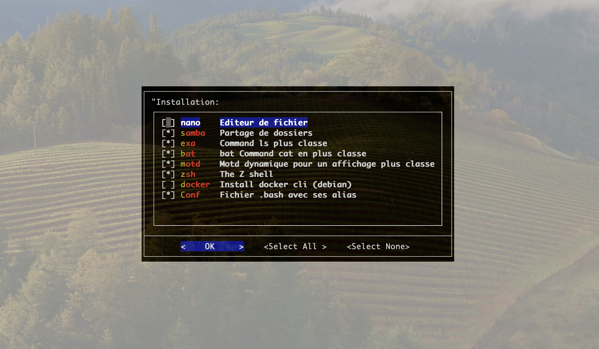
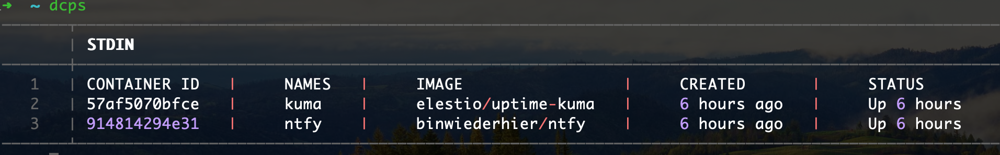
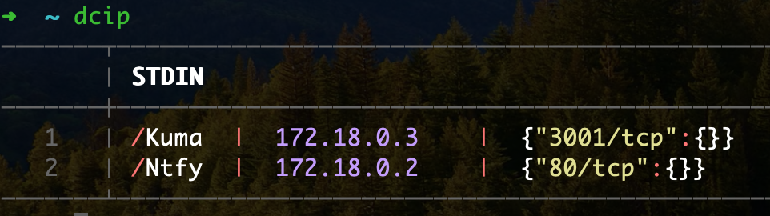
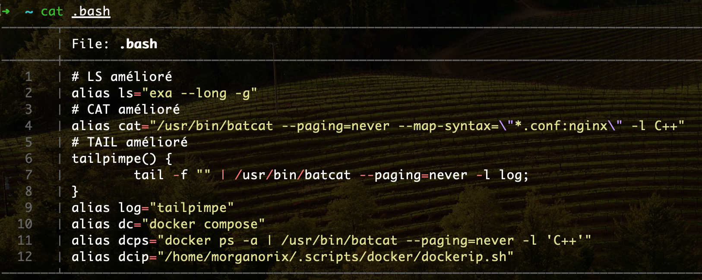
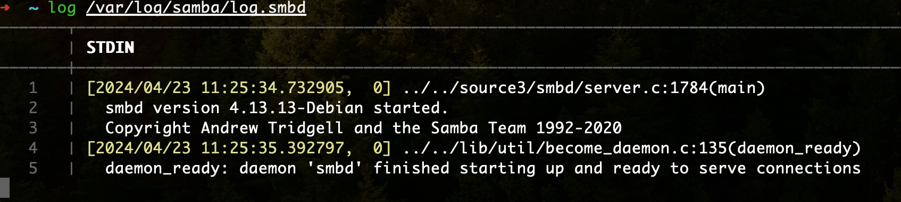

# Project : install env
This is a graphical installation with multiple choices for configuring an optimal ssh environment.

(Works on Debian or rapsaberry)



## Installation

Connect to new environnment linux via ssh.

Copy directory folder **env/** in your user profile **~/**.
```
➜ ~/ git clone git@github.com:morganorix/installenv.git
```

Run the **install.sh** file and follow the procedure.

Use example
```
➜ ~/ bash env/install.sh
```
Or
```
➜ ~/ ./env/install.sh
```

## Use

Aliases are installed according to the installation you have chosen.

### dcps

It's a docker compose ps more pretty and lisible



```
➜ ~/ dcps
───────┬────────────────────────────────────────────────────────────────────────────────────────────────────
       │ STDIN
───────┼────────────────────────────────────────────────────────────────────────────────────────────────────
   1   │ CONTAINER ID   |     NAMES   |     IMAGE                 |     CREATED       |     STATUS
   2   │ xxxxxxxxxxxx   |     kuma    |     elestio/uptime-kuma   |     6 hours ago   |     Up 6 hours
   3   │ xxxxxxxxxxxx   |     ntfy    |     binwiederhier/ntfy    |     6 hours ago   |     Up 6 hours
───────┴────────────────────────────────────────────────────────────────────────────────────────────────────

```

### dcip

As dcps, it display more pretty and lisible ips and ports by conteners.



```
➜ ~/ dcip
───────┬─────────────────────────────────────────────────────────────────────────────────────────────────────
       │ STDIN
───────┼─────────────────────────────────────────────────────────────────────────────────────────────────────
   1   │ /Kuma  |  172.18.0.3    |  {"3001/tcp":{}}
   2   │ /Ntfy  |  172.18.0.2    |  {"80/tcp":{}}
───────┴─────────────────────────────────────────────────────────────────────────────────────────────────────
```

### cat

It's a cat more pretty and lisible



```
➜ ~/ cat .bash
───────┬──────────────────────────────────────────────────────────────────────────────────────────────────────
       │ File: .bash
───────┼──────────────────────────────────────────────────────────────────────────────────────────────────────
   1   │ # LS amélioré
   2   │ alias ls="exa --long -g"
   3   │ # CAT amélioré
   4   │ alias cat="/usr/bin/batcat --paging=never --map-syntax=\"*.conf:nginx\" -l C++"
   5   │ # TAIL amélioré
   6   │ tailpimpe() {
   7   │         tail -f "$1" | /usr/bin/batcat --paging=never -l log;
   8   │ }
   9   │ alias log="tailpimpe"
  10   │ alias dc="docker compose"
  11   │ alias dcps="docker ps -a | /usr/bin/batcat --paging=never -l 'C++'"
  12   │ alias dcip="/home/morganorix/.scripts/docker/dockerip.sh"
───────┴───────────────────────────────────────────────────────────────────────────────────────────────────────
```

### log

It's a cat more pretty and lisible.



```
➜ ~/ sudo log /var/logs/samba/log.smbd
───────┬────────────────────────────────────────────────────────────────────────────────────────────────────────
       │ STDIN
───────┼────────────────────────────────────────────────────────────────────────────────────────────────────────
   1   │ [2024/04/23 11:25:34.732905,  0] ../../source3/smbd/server.c:1784(main)
   2   │   smbd version 4.13.13-Debian started.
   3   │   Copyright Andrew Tridgell and the Samba Team 1992-2020
   4   │ [2024/04/23 11:25:35.392797,  0] ../../lib/util/become_daemon.c:135(daemon_ready)
   5   │   daemon_ready: daemon 'smbd' finished starting up and ready to serve connections
```
